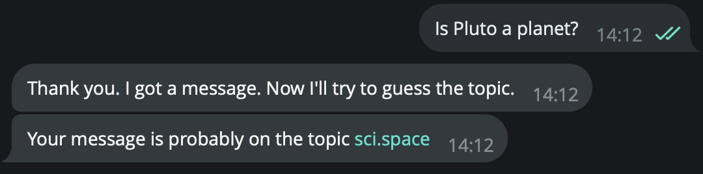
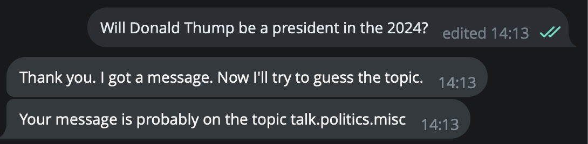
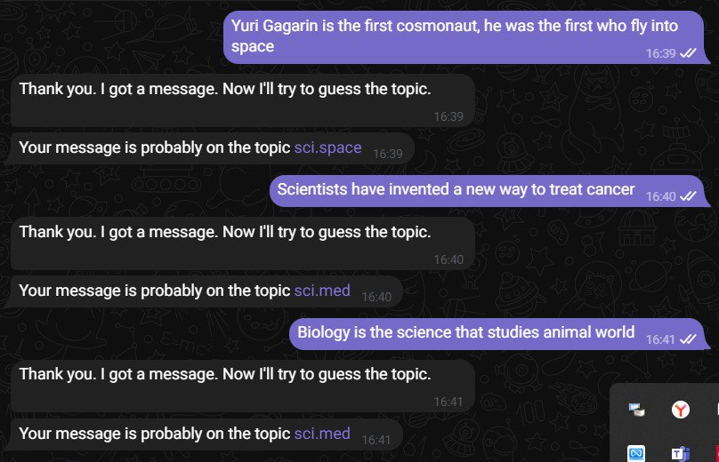

## Телеграмм-бот, который классифицирует сообщения по темам.

### Итоговый проект по дисциплине "Задачи NLP в машинном обучении", магистратура ТГУ. 

Исполнитель проекта: Сивиринов И.С.

Результат: [Final_project_tg_bot.ipynb](Final_project_tg_bot.ipynb)

Screenshots:

### Суть проекта

телеграмм-бот, который принимает сообщение от пользователя, классифицирует его и возвращает текстовый комментарий с выводом темы, которая поднимается в сообщении. Коммуникация осуществляется на английском языке. 

### Библиотеки

- sklearn
- pandas
- pickle
- telebot

### Датасет для обучения модели 

fetch_20newsgroups from [sklearn.datasets](https://scikit-learn.org/stable/modules/generated/sklearn.datasets.fetch_20newsgroups.html)

### Суть работы:

#### Блок А - создание модели

1. Импортируем датасет с 20 группами новостей для задач классификации
2. Производим предобработку текста: векторизуем текст с помощью TfidfVectorizer, используем stop_words='english'
3. Разделяем обработанный датасет на обучающую и тестовую выборки
4. Создаем модель Support Vector Classification, обучаем ее на трейне и тестируем на тесте
5. Измеряем метрики качества: Accuracy и Classification Report
6. Сохраняем обученную модель для последующего ее использования в чат-боте
7. Тестируем работу загруженной модели на одном сообщении

####  Блок В - создание чат-бота

1. Создаем чат-бот
2. Прописываем логику старта работы и получения от пользователя сообщения
3. Прописываем логику обработки сообщения и возвращение пользователю предсказания темы введенного им сообщения

